# DrawBox v2 Design Doc (BLUE)

## Objective

The objective of this doc is to propose a new architecture for DrawBox v2.

## Background

This library is based on Compose Multiplatform that enables it to be used across multiple platforms.
A user can draw on a `Canvas` by touching or dragging his finger on the screen.
Then, the `Canvas` is converted to an image.

The idea of creating this open-source project appeared because I needed a multiplatform (Android + desktop) library for drawing.
I found several popular libs for Android but there was **ZERO** for using in KMP (Kotlin Multiplatform).
Right now, there are several libraries already, so the goal is to extend the functionality to make the library cover more use-cases.

DrawBox targets **application developers building on KMP who need a drawing canvas that works out of the box.**
It optimizes for approachability and a small, comprehensible API surface.
The working assumption is that large teams and organizations with bespoke requirements will build their own tailored implementation regardless.
Therefore, DrawBox aims to cover the common ~80% cleanly rather than to be maximally configurable.
Where extension is offered, it is offered as the *simplest mechanism that meets the need*, not a general plugin framework.

# Design

## Overview

### The main idea

A drawing is stored as a list of `Action`s.
One `Action` describes one edit made by a user: a brush stroke, a shape, a color fill, an erase.
As user keeps drawing, a list of these `Action`s is created and called the `ActionHistory`, and it is the single source of truth: the picture can always be re-created by drawing the `Action`s again, one by one, in order.

What the user sees is a bitmap called the **current image**.
It is produced from the action history and works as a cache.
The library modifies the current image in only two ways: it draws a new action onto the current image, or it re-draws the current image from the action history after a removal (undo, action erase).

Keeping both — the action list (vector data format) *and* a rendered bitmap (raster data format) — is the central decision of v2:

- The action history gives lossless undo/redo, saving and loading a drawing as plain data, and sharp output at any resolution.
- The current image gives tools that need real pixels — in 2.0, color fill — and keeps display cost constant: to display the drawing, one bitmap is drawn, regardless of how many actions the history contains.

Neither format alone covers both lists. That is why v1 (vector-only) could not support color fill.
(The two single-format approaches are compared in [Alternatives considered](#alternatives-considered), A1.)

### What happens when the user draws

One brush stroke, step by step:

1. The user touches a `DrawBox` — the composable that shows the drawing and receives gestures.
2. `DrawBox` converts the touch position from its own pixels into **normalized coordinates** — numbers from 0 to 1, independent of any screen or bitmap size — and passes the converted point to the `DrawController`.
3. The controller gives the point to the active **tool** (brush, shape, fill, …), together with the current **settings** (color, stroke width, …). The settings are stored in the controller, not in the tool — the tool is stateless and receives the settings as arguments (see A9). From the point and the settings the tool builds a new action, which the controller keeps as the **ongoing action**.
4. While the finger moves, each new point extends the ongoing action (the tool returns an updated copy each time). The ongoing action is drawn on the **active image** — a transparent bitmap shown on top of the current image. The current image is not modified during the gesture.
5. When the finger lifts, the stroke is finished: points that do not change the shape are removed, the line is smoothed, the finished action is added to the action history, drawn once onto the current image, and the active image is cleared.

As a result, a stroke with 500 points causes 500 re-draws of the active image (one action drawn each time) and exactly one write to the current image.

While one action is ongoing, attempts to start another action (a second finger, a palm, a second view) are ignored until the first action ends.
This rule is the **gesture lock**: many input sources, one action at a time.

### The images

The library owns exactly **three** bitmaps — there are no others:

| Image                | What it shows                             | When it changes                                        |
|----------------------|-------------------------------------------|--------------------------------------------------------|
| **Current image**    | all committed actions                     | once per finished action; re-built after undo          |
| **Active image**     | only the ongoing action                   | on every gesture move; cleared when the action commits |
| **Checkpoint image** | the drawing as it was several actions ago | follows the current image, N actions behind            |

All three are **transparent** wherever nothing has been drawn.
Because of this, the library has no background API: the consumer places a composable (for example, a colored box or a photo) behind the `DrawBox`, and that composable is visible through the transparent parts of the drawing.
Exported bitmaps keep the transparency, so after export the consumer can place the drawing over another image.
One limit follows from this: color fill reads pixels only from the current image; the background composable is not part of the current image (see A8).
(Names for the three images were debated — see A7.)

### Coordinates and sizes

There are three kinds of coordinates, and only one of the three is stored:

- **View pixels** — the on-screen size of one `DrawBox`. Each view has its own.
- **Normalized coordinates (0..1)** — the only space actions are stored in. Not tied to any pixel size.
- **Image pixels** — the size of the bitmaps above (and of an exported bitmap).

Each conversion is done by the component that owns the pixel size involved.
`DrawBox` converts each touch position into normalized coordinates and passes the result to the controller. For display, `DrawBox` draws the controller's internal bitmaps directly (see A11).

The controller converts normalized actions into image pixels when drawing them into its bitmaps.
The controller does not receive or process view pixels at any point.
(Alternative placements for this conversion — see A4.)

The `DrawController` is created with one required parameter — the **canvas size** (e.g. 1600×900 pixels). The parameter has no default value (A5). Two properties follow from the canvas size:

- **The aspect ratio cannot be changed after creation.** Normalized coordinates stretch to whatever rectangle they are drawn into, so changing the ratio later would deform the drawing.
- **The working resolution can be changed by an explicit function call** (see A13). The new resolution must have the same aspect ratio as the original. When the resolution changes, the three bitmaps are re-allocated at the new pixel size, and the action history is re-drawn into the new bitmaps — actions are stored in normalized coordinates, so re-drawing at a different pixel size produces correct results. The call must not overlap with an ongoing gesture; the gesture lock must be released first. Use case: a consumer starts at a resolution matching the screen (e.g. 800×450) and later increases the resolution (e.g. 3200×1800) before exporting, or decreases it to reduce memory use.

If a `DrawBox` view has a different shape than the canvas, the picture is shown at the largest size that fits inside the view, centered, with empty space on the remaining sides.
If a different output size is needed, `export(size)` re-draws the whole history into a new bitmap of that size (same aspect ratio) and returns the new bitmap.

### Undo, redo, and the checkpoint image

Undo removes the last action from the action history and pushes that action onto a **redo stack**. Redo pops the top action from the redo stack and appends the action back to the action history. The redo stack is the only extra data structure — the action history itself is the undo source.
Undo works the same way for every kind of edit (adding a stroke, erasing an action); there is no per-tool undo logic.

After an undo, the current image no longer matches the history and must be re-drawn.
Re-drawing from the first action would take longer as the history grows, so the **checkpoint image** exists:

- The checkpoint image trails the current image by up to N actions (default N = 5).
- Undo within those last N actions: copy the checkpoint, re-draw only the missing actions (at most N).
- Undo deeper than that: re-draw both images from the first action; the checkpoint is placed N actions behind again.

The number of actions between checkpoints is a constructor parameter (`checkpointInterval`, default 5). The consumer sets this number when creating the controller.
Before the first checkpoint is taken (fewer than N actions in the history), undo re-draws from the first action — which is fast because the history is short.
(Alternatives — no checkpoint at all, several checkpoints — see A6. Why an integer instead of a configurable interface — see A15.)

### Output and input

The controller's state is accessed by three parties, and each party has a different level of access:

- **Tools** have no access to controller state — each value a tool uses arrives as a function argument (see the Settings paragraph in Detailed design).
- **`DrawBox`** displays the drawing by collecting `image(ImageMode.Live)` from the controller — the same public API that any consumer uses. More than one `DrawBox` may be attached to one controller. (Why DrawBox does not read internal bitmaps directly — see A11.)
- **Consumers** use the public API. The public API contains the rendered image in two modes, plus the state needed for undo/redo buttons:
  - `image(mode): StateFlow<ImageBitmap>` — the rendered image. `ImageMode.Committed` delivers the drawing without the ongoing action; a new value once per finished action, undo, or redo. `ImageMode.Live` delivers the drawing with the ongoing action merged in; new values arrive during the gesture as well. Each Live value requires allocating and merging a new bitmap, once per gesture move; merged values are produced only while at least one consumer collects the stream. (Why one function with a mode instead of a Boolean parameter or two properties — see A12.)
  - `canUndo` / `canRedo: StateFlow<Boolean>` — for enabling and disabling buttons.
  - Saving and loading pass the action history as a function result and argument (`snapshotHistory`, `loadHistory`); the history is not observable.

The action history and the ongoing action are **not** part of the public API (reasons: A10).

Input arrives at the controller as four function calls carrying normalized coordinates: `onTap`, `onDragStart`, `onDrag`, `onDragEnd`.
The controller does not distinguish between calls made by `DrawBox` (gestures) and calls made by consumer code (programmatic drawing) — both use the same four functions.
There is no connect/disconnect handshake in either direction; the v1 connection state does not exist in v2.

State changes happen on the main thread inside the controller; because the data is immutable, reading it from another thread is safe.
Color fill and export are `suspend` functions, so their long-running part (reading pixels, re-drawing the history) can run off the main thread.

### Scope and extensibility (YAGNI)

Version 2.0 provides a closed, high-quality set of built-in tools (Brush, Erasers, Fill) and a fixed set of action types. There are no public registries or extension points for custom tools, custom brushes, or custom fills.

**Reasoning:** Premature generalization. Most consumer applications want a reliable, plug-and-play drawing canvas without writing custom rendering algorithms. Exposing interfaces like `Tool` or `BrushRenderer` as public API commits the library to an extensibility contract before the community's real needs are known. If consumer demand in the future proves that custom brushes or patterned fills are needed, extension points can be added (additive changes do not break existing code). For 2.0, minimizing the public API surface area and cognitive load is prioritized. (See A19 for the rejected registry design).

## Infrastructure

**Targets and constraints.**
All library code lives in `commonMain`; only standard Compose Multiplatform APIs are used; Android, Desktop (JVM), iOS, and Web (Wasm/JS) build from the single codebase.
The library boundary is plain data plus `ImageBitmap`: no image file encoding/decoding and no file access — those belong to the consumer.

**Modules** (dependencies point one way only):

| Module                             | Contents                                                   | Depends on                                         |
|------------------------------------|------------------------------------------------------------|----------------------------------------------------|
| `drawbox-core` (required)          | model, controller, rendering, built-in tools               | Compose UI graphics/foundation, kotlinx-coroutines |
| `drawbox-ui` (optional)            | color picker, brush/size/tool controls, example toolbar    | core                                               |
| `drawbox-serialization` (optional) | action history ↔ JSON, versioned format                    | core                                               |
| `sample`                           | wiring demos across all targets                            | all of the above                                   |

**API discipline.**
Kotlin Explicit API mode is on.
After 2.0 the core API is stable. Adding new tools or a new action type in a minor release are the main compatibility-sensitive changes and are documented as such.

**Testability.**
The model and tools test without any UI: building and extending actions, hit-testing, point simplification, and fill-region computation are plain functions — tests feed normalized points directly.
Rendering is covered by bitmap comparison tests.
One invariant gets a dedicated test: drawing the same history twice must produce identical bitmaps (color fill depends on this, because a fill re-computes its region from what is drawn beneath it).

## Detailed design

### High-level Architecture

```mermaid
classDiagram
    class DrawBox {
        <<Composable>>
        +DrawController controller
        -handleDragGestures()
    }

    class DrawController {
        <<Facade>>
        +DocumentManager document
        +DrawSettings settings
        +ImageManager images
        +GestureController gestures
    }

    class DocumentManager {
        <<Source of truth>>
        +ActionHistory history
        +RedoStack redoStack
        +undo()
        +redo()
        +commitAction()
    }

    class ImageManager {
        <<Raster state>>
        +ImageBitmap current
        +ImageBitmap active
        +ImageBitmap checkpoint
        +allocateBuffer()
    }

    class DrawSettings {
        <<Configuration>>
        +DrawTool tool
        +Long color
        +Float strokeWidth
        +Float fillTolerance
    }

    class GestureController {
        <<Input Guard>>
        +onDragStart(point)
        +onDrag(point)
    }

    class RenderEngine {
        <<Orchestrator>>
        +render(ActionHistory, ImageBitmap)
    }

    DrawBox --> DrawController : sends normalized inputs
    DrawController *-- DocumentManager
    DrawController *-- ImageManager
    DrawController *-- DrawSettings
    DrawController *-- GestureController
    GestureController --> RenderEngine : triggers
    RenderEngine --> ImageManager : draws onto
```



**Who owns what.**
The library state is split into four domains, exposed to the consumer through a `DrawController` facade:
- **`DocumentManager`**: Owns the `ActionHistory` and `RedoStack`. It provides the `undo()` and `redo()` operations and is the single source of truth for the drawing data.
- **`ImageManager`**: Owns the three bitmaps (current, active, checkpoint) and handles their allocation.
- **`DrawSettings`**: Owns the configuration (active tool, color, stroke width, fill tolerance). It is independent of the document data.
- **`GestureController`**: Owns the gesture lock. It receives normalized points, serializes input, and routes gestures to the active tool.

There are two stateless execution components:
- **`RenderEngine`**: A stateless orchestrator. It iterates over the `ActionHistory` and delegates to the tools to draw actions onto an `ImageBitmap`.
- **`Tool`**: A stateless function (Brush, Fill, Erasers) that converts points into an `Action`, or draws an `Action` onto a `Canvas`. Tools own no data. The accumulating state of a gesture is the ongoing action, which is passed into the tool and returned as an updated copy.

Each `DrawBox` owns only the mapping between its view pixels and normalized coordinates.

**Settings.**
One set of settings — the active tool, color, stroke width, fill tolerance — is grouped into a single `DrawSettings` state block. The consumer changes these values via explicit update methods on the controller (e.g., `setTool(...)`, `setColor(...)`), rather than mutating fields directly. Switching tools keeps the same color and width.
Settings are read once when a gesture starts: the library copies their values into the new action.
Changing the settings afterwards does not modify existing actions or the ongoing gesture — the change affects only the *next* action.
(Whether settings should instead be stored inside each tool was considered — see A9. Grouping in the API — see A18.)

**Commit, step by step** (finger up): (1) the raw points pass through the `StrokeProcessor` — points that do not change the shape are removed, the line is smoothed; (2) the finished action is drawn onto the current image (only the new action — nothing is re-drawn); (3) the action is appended to the action history; (4) the ongoing action is cleared, if the number of actions since the last checkpoint equals `checkpointInterval` the checkpoint image is updated, the gesture lock is released.
Starting a new gesture clears the redo stack (see A14 for the rejected two-stack alternative).

**Each tool follows the same sequence** — only the action's content differs; the dispatch is always "action → the tool that made it" through the registry (there is no `when (tool)` switch anywhere):

- *Color fill (tap):* the action stores the tap point, the color, and the tolerance — three numbers, not the filled pixels. When drawn, the fill reads the current image's pixels beneath its position in the history and computes the region again at that moment. This is why identical re-drawing matters (see Testability).
- *Pixel eraser:* a brush whose drawing mode clears pixels instead of adding them. An ordinary action in the history.
- *Action eraser:* the reverse direction — while the finger moves, the controller calls each action's tool's hit-test with the drag path and collects the IDs of the actions that were hit; at commit the controller removes those actions from the history. A removal invalidates the current image → re-draw (via checkpoint when possible). Stable action IDs exist for this.

**Export.**
`suspend export(size)`: create a new transparent bitmap of the requested size (same aspect ratio as the canvas), draw the actions in order, return the bitmap.
The checkpoint is not involved; view sizes are not involved.

**Concurrency of suspend operations.**
Color fill and export are `suspend` functions — the pixel-level work can run off the main thread. The question is what happens when a user triggers a fill and then immediately starts drawing before the fill computation finishes.
The gesture lock covers the entire commit step, including the fill's pixel computation. While a fill is being committed, the lock is held, so a new gesture is ignored until the fill finishes and the lock is released. The `suspend` keyword lets the pixel work move to a background thread (no main-thread freeze), but the lock prevents a second action from starting in parallel. On typical canvas sizes, a fill completes in under 50 ms — below the user's reaction time.
Export does not hold the gesture lock. Export creates its own bitmap and reads a snapshot of the action history. Because the history is an immutable list, the snapshot is a reference to the list at the moment export started — new actions appended after that do not affect the export bitmap. A user can draw while export runs.
(Why the gesture lock covers the full fill commit instead of releasing early — see A17.)

**Public API (vital parts).**

```kotlin
enum class ImageMode { Committed, Live }                // without / with the ongoing action
enum class DrawTool { Brush, Eraser, ActionEraser, ColorFill }

data class DrawSettings(
    val color: Long = 0xFFFF0000,
    val strokeWidth: Float = 10f,
    val tool: DrawTool = DrawTool.Brush,
    val fillTolerance: Float = 32f
)

class DrawController(
    canvasSize: IntSize,                                // required, no default — fixes aspect ratio + working resolution
    checkpointInterval: Int = 5,                        // take a checkpoint every N committed actions
    startingColor: Long = 0xFFFF0000,                   // flat constructor for convenience
    startingWidth: Float = 10f,
    startingTool: DrawTool = DrawTool.Brush,
) {
    // output — the image in two modes, plus button state (internals are not exposed; A10)
    fun image(mode: ImageMode): StateFlow<ImageBitmap>  // Committed: one value per commit/undo/redo;
                                                        // Live: values during gestures, merged per value, produced only while collected
    val canUndo: StateFlow<Boolean>
    val canRedo: StateFlow<Boolean>

    val settings: StateFlow<DrawSettings>               // observable grouped state
    fun setTool(tool: DrawTool)
    fun setColor(color: Long)
    fun setStrokeWidth(width: Float)

    // input — normalized coordinates; gestures and code are indistinguishable
    fun onTap(p: NormPoint); fun onDragStart(p: NormPoint); fun onDrag(p: NormPoint); fun onDragEnd()

    fun undo(); fun redo(); fun clear()
    fun snapshotHistory(): ActionHistory                // for saving (used by drawbox-serialization)
    fun loadHistory(history: ActionHistory)             // restore a saved drawing; clears undo/redo
    suspend fun export(size: IntSize): ImageBitmap      // same aspect ratio, any resolution; transparent background
}

@Composable
fun DrawBox(controller: DrawController, modifier: Modifier = Modifier)
```

Creating a working canvas takes two lines — `DrawController(canvasSize = IntSize(1600, 900))` and `DrawBox(controller)`. Every constructor parameter except `canvasSize` has a default.

## Migration

v2 is a **clean break** from 1.x: no API or data migration path — an accepted cost stated up front.
1.x remains published; v2 ships as a new major version.
Concept mapping for consumers:

| v1.x | v2 |
|------|----|
| Connection handshake, square-only canvas | no handshake; canvas size (any ratio) chosen at creation |
| `PathWrapper` list | action history — one typed action per edit |
| Pen only | brush / fill / two erasers |
| `getBitmap(size, subscription): StateFlow<ImageBitmap>` | `image(mode)` at the working resolution; `suspend export(size)` for other sizes |
| `DynamicUpdate` / `FinishDrawingUpdate` modes | `ImageMode.Live` (updates during the gesture) / `ImageMode.Committed` (updates per finished action) |
| `undoCount` / `redoCount` | `canUndo` / `canRedo` |
| `background: DrawBoxBackground` parameter | no API: a composable behind the canvas shows through the transparent drawing |
| `open(image)` (photo to draw upon) | no API: photo behind the `DrawBox` for display; combine photo + exported bitmap after export (see A8) |

Milestones — M1 and M2 must come first; the order of the rest is negotiable:

**M1** core skeleton (model, controller, canvas size contract, normalized input, brush, export, checkpoint image) →

**M2** tool set (both erasers, fill) →

**M3** quality (stroke simplification/smoothing) →

**M4** serialization module →

**M5** UI module + samples on all targets.

Moved out of the 2.0 scope, planned for a later release: 
- **Shapes** (line, rectangle, ellipse): deferring simple geometries to later keeps the initial core focused.
- **Eyedropper** (reads one pixel of the current image into the color setting; adding it later changes no existing API).
- **Text tool** (rendering and editing text on the canvas; adding it later changes no existing API).
- **Image tool** (inserting a bitmap image as an action on the canvas that can be moved/scaled and drawn upon).

## Technical debt

Debt v2 knowingly takes on, each item with the trigger to revisit it:

- **Fixed action set.** A new action *type* requires a library release; new brush styles, fill behaviors, and tools over the existing types do not (the exact boundary is stated in Extending the library). This is the intended reading of the extensibility goal, not a missed goal — the goal promises new brushes and tools, and the fixed set supports both. The open-set alternative stays recorded for 3.0 (A2, including how tldraw builds it and what it costs).
- **The checkpoint default N = 5 was chosen without measurement.** Tune with profiling on realistic histories; actions that take longer to re-draw (fill) may justify a different default policy.
- **One gesture at a time.** The gesture lock ignores concurrent input sources; per-source concurrency belongs to a future collaboration feature. Palm rejection beyond the lock is out of scope for 2.0.
- **Gesture cancellation.** Proposed: a cancelled gesture discards the ongoing action without committing — pending confirmation.
- **View shape ≠ canvas shape.** The fit-inside-with-empty-space behavior needs validation in the samples.
- **Fill cannot use the background.** With no baked-in photo layer, fill reads only pixels drawn in DrawBox. Revisit if photo-annotation users ask for it — a baked-in photo layer can be added later without breaking the API (see A8).
- **Platform validation.** Each relied-upon common API (`ImageBitmap.readPixels`, clear blend mode, drag gestures) must be verified on all four targets in the pinned Compose Multiplatform version before M1 is declared done.
- **`image(ImageMode.Live)` allocates and merges a bitmap per gesture move while collected.** Acceptable for an observer that samples the drawing; not intended as the display path — display is `DrawBox`'s job (A11 has the allocation numbers). Revisit whether the Live mode is needed at all once the M6 samples exist; removing a mode before 2.0 ships costs nothing, removing it after 2.0 is a breaking change.
- **One shared settings set for all tools.** A custom tool with its own setting has no official slot, and, for example, a brush and an eraser cannot keep different widths unless the consumer's UI re-sets the width on tool switch. Revisit when a real tool needs a setting outside the shared set — the per-tool settings extension (A9, option 3) can be added without breaking the API.
- **No per-gesture scratch object.** Transient gesture state is stored in the ongoing action by design; a future tool that needs non-saved scratch data (pressure history, multi-finger tracking) will require a new concept.

## Glossary

Definitions of the terms used in this document:

| Term | Meaning |
|------|---------|
| **Action** | plain data — named fields with values, no behavior, never changed after creation — describing one edit (stroke, shape, fill, erase) |
| **Action history** | the ordered list of actions; the single source of truth |
| **Ongoing action** | the action being built during the current gesture; not yet in the history |
| **Commit** | the moment a gesture ends and its ongoing action is added to the action history |
| **Tool** | stateless converter of input points into actions; also draws and hit-tests its own actions |
| **Stateless** | keeps no data between calls — each value a tool needs arrives as an argument |
| **Hit-test** | the check "does this point or path touch this action?" — used by the action eraser |
| **Current image** | bitmap with all committed actions, at the working resolution; transparent where nothing is drawn |
| **Active image** | transparent bitmap with only the ongoing action, shown above the current image |
| **Checkpoint image** | copy of the current image from N actions ago; reduces re-drawing after undo |
| **Live image** | the current image with the ongoing action merged on top, produced per value for collectors of `image(ImageMode.Live)` — not one of the three stored bitmaps |
| **Image mode** | the parameter of `image()`: `Committed` (without the ongoing action) or `Live` (with it) |
| **Canvas size** | pixel size chosen at controller creation; fixes aspect ratio + working resolution |
| **Working resolution** | the pixel size the three images are rendered at (= canvas size) |
| **Normalized coordinates** | positions as numbers 0..1, independent of any pixel size; the only stored geometry |
| **Export** | re-drawing the whole action history into a new bitmap of a requested size |
| **Gesture lock** | one ongoing action at a time; other input attempts are ignored meanwhile |
| **Settings** | the active tool, color, stroke width, and fill tolerance the next action will use; stored in the controller, copied into the action when a gesture starts |
| **Fill tolerance** | how different a pixel's color may be from the tapped pixel and still be filled |
| **Consumer** | the application developer using the DrawBox library |
| **`StateFlow`** | a Kotlin container that holds the latest value and notifies its observers when the value changes |

## Alternatives considered

### A1. Pure vector or pure raster instead of hybrid

**Pure vector (v1 extended):** simplest undo and saving; fully resolution-independent. Cannot do color fill or the pixel eraser — there are no pixels. Rejected: those tools are in scope.

**Pure raster:** pixel tools need no extra machinery. But undo requires storing bitmap copies, whose combined memory grows with the history; resize is lossy; export is bound to one resolution; and saving loses editability. Rejected.
The hybrid keeps raster's tool support and vector's undo/export/saving; its cost — keeping bitmaps consistent with the history — is contained in one place (the current and checkpoint images).

### A2. Open action set: each tool defines its own action type

The considered alternative to the fixed action set: *an action is anything its tool can draw* — each tool defines its own action type, and the library stores actions without understanding their content.

**Pros:**
- New tools (with new action types) without touching the library — the strongest form of third-party freedom.
- The library core shrinks: it no longer knows what a "shape" or "fill" is.

**Cons:**
- Saving breaks apart: the library cannot serialize action types it does not know. Each custom tool must ship its own serializer, and a saved drawing loads only if each tool that produced it is registered — otherwise the file is partly unreadable.
- No compile-time completeness: with the fixed set, the compiler forces each operation (draw, hit-test) to handle each action type; with an open set, gaps appear at runtime.
- Approachability suffers: consumers face "how do I define an action type, how do I serialize it, what happens on load" even when they only wanted a canvas.

**Decision for 2.0:** fixed set, because saved-drawing portability and a small conceptual surface are project goals (see Background). The middle ground covers most known needs: new *styles* are data keys inside existing action types (see Extending the library), and new *interactions* can still implement `Tool` over the existing action types. Revisit for 3.0 if consumer demand shows the style-level and tool-level paths are not enough.

**Prior art — both models exist in shipped canvas libraries:**
- **tldraw** uses the open set: each shape type has a `ShapeUtil` class (rendering, hit-testing, interactions) registered in the editor; shape data are JSON records with per-type validation and schema migrations. The migration subsystem is the price of loading old documents while custom types evolve.
- **Fabric.js** uses inheritance plus a class registry: a custom class overrides its own serialization (`toObject`) and registers itself (`classRegistry.setClass`) so saved documents can be loaded — with documented friction around deserializing custom compositions.

Both confirm the cost list above: an open set is buildable, and it brings per-type serializers plus a schema/migration mechanism with it.

### A3. What an action stores: interpreted data vs raw touch points

Within any action model there is a second question: store the *interpreted* result (two corner points for a rectangle; tap point + color + tolerance for a fill) or the *raw gesture* (every touch point) and let the tool re-interpret on every re-draw.

**Interpreted (chosen):** actions store few values and keep their meaning — a rectangle is two corner points, a fill is three numbers; a rectangle can be re-drawn while the gesture continues and hit-tested against its true outline. The tool interprets the gesture once, at drawing time.
**Raw points:** every action has one uniform shape (a list of points); the tool stays the single owner of meaning. But actions keep every input point permanently, re-drawing repeats the interpretation work every time, hit-testing loses shape knowledge, and some tools do not fit the model at all — a fill's "gesture" is one tap; the *color and tolerance* are settings, not points.

Note the two questions are independent: even with an open action set (A2), tools would still be better off storing interpreted data.

### A4. Where view pixels become normalized coordinates

1. **In `DrawBox`, at the edge (chosen):** the view already knows its own size (it needs the same mapping to draw the ongoing action); the controller does not process view pixels; programmatic input and gestures share one entry point; the core tests without any UI.
2. **In the controller:** the controller must then track the size of each view — this re-creates the v1 connection handshake that caused the square-only limit and the single-view limit.
3. **Pass the view size along with every event:** works, but adds a parameter to every call to solve a problem the view can solve locally, and two views sending events would still need per-event disambiguation.

### A5. How the canvas gets its size

1. **Required at creation (chosen):** the consumer passes `canvasSize`; there is no default. The controller is fully defined from creation; each `DrawBox` that uses the controller receives the same bitmap; the aspect ratio cannot change after creation. An earlier draft had a default (1024×1024); the default was removed because any default is a value chosen without data that determines the resolution of every drawing — requiring the parameter makes the choice visible to the consumer. Cost: creating a controller requires one explicit argument, and a `DrawBox` whose shape differs from the canvas shows empty margins.
2. **Auto from the first view:** zero configuration, and the canvas shape matches the `DrawBox` in the one-view case. Rejected as the primary mode because of a sequencing problem and several open questions described below. It may return later as a convenience constructor.

   **The sequencing problem.** The consumer creates `DrawController` first and passes the controller to `DrawBox`. But the view size of `DrawBox` is known only after Compose measures the composable. The controller needs the canvas size to allocate its bitmaps; the canvas size comes from a composable that requires the controller. Five implementation sub-options were considered:

   **2a. Deferred initialization.** The controller is created without a canvas size and starts in a "not yet initialized" state. The first `DrawBox` that is composed reports its measured size to the controller, and the controller allocates its bitmaps at that point. Gesture input received before initialization is ignored. Problem: the controller is not usable until a `DrawBox` is composed — programmatic drawing without a view is not possible. A second `DrawBox` with a different size requires a rule (first wins, or error) that the consumer cannot predict. Every public method on the controller must handle the "not yet initialized" state.

   **2b. Factory composable.** `DrawBox` creates the controller internally and passes the controller to the consumer through a trailing lambda. The composable knows its own size at measure time, so there is no sequencing gap. Problem: the consumer cannot `remember` the controller above `DrawBox` in the composition tree — buttons and pickers that reference the controller must be placed inside the lambda. Two `DrawBox` composables sharing one controller is no longer possible.

   **2c. BoxWithConstraints wrapper.** The consumer wraps `DrawBox` in `BoxWithConstraints` (or `SubcomposeLayout`) and reads the constraints before creating the controller. The controller is created with `remember` keyed on the measured size. No library changes are needed. Problem: the consumer must write the wrapper boilerplate. If the `remember` key includes the constraints, a window resize recreates the controller and the drawing history is lost — unless the consumer adds a guard, which adds more boilerplate. `BoxWithConstraints` triggers subcomposition.

   **2d. Aspect ratio at creation, resolution deferred.** The constructor takes an aspect ratio (one number) instead of a pixel size. The aspect ratio is fixed at creation and defines the shape of the normalized coordinate space. The pixel resolution — the size of the three bitmaps — is determined when the first `DrawBox` reports its measured size, or by an explicit call. A window resize can change the resolution without changing the aspect ratio (the drawing is not deformed; the bitmaps are re-allocated). Problem: two concepts instead of one (aspect ratio and resolution). A consumer who needs a specific resolution (for example, to match an export target of 3840×2160 pixels) must still pass the resolution explicitly.

   **2e. `rememberDrawController()` composable function.** A `@Composable` factory function that accepts a `CanvasSize` parameter with two modes: `CanvasSize.Fixed(width, height)` and `CanvasSize.MatchView`. In `MatchView` mode the function defers bitmap allocation until the first `DrawBox` reports its measured size (same as 2a, but the deferred state is hidden inside the function). The explicit `DrawController(canvasSize)` constructor remains for non-Compose use and for tests. Problem: `rememberDrawController()` can only be called inside a composable scope — not in a ViewModel or a plain Kotlin class. The function adds a Compose-coupled API to a library that keeps the controller and model layers free of Compose dependencies.

3. **Per-observer resolution (each display stream picks its own size):** each consumer receives the exact pixel size the consumer asked for. Rejected: N observers require N full renderings, and two renderings of the same history at different pixel sizes are not pixel-identical — the same drawing would differ between observers. The need is served explicitly instead: observe `image(ImageMode.Committed)` for the shared bitmap; call `export(size)` when a specific size is needed.

### A6. Undo speed: how much rendering to cache

1. **No cache — always re-draw from the first action:** simplest; the cost of each undo grows with history length.
2. **One trailing checkpoint image (chosen):** one extra bitmap of memory; an undo within the last N actions re-draws at most N actions; the consumer sets N as a constructor parameter (default 5). See A15 for why N is a plain integer, not a configurable interface.
3. **Multiple checkpoints (every K actions, keep M):** undo cost stays near-constant at any depth; costs M extra bitmaps of memory. More than 2.0's single-user editing needs; the integer parameter can be replaced by a richer API in a future version without breaking the constructor signature.

### A7. Names

- **The three bitmaps** — chosen: *current image / active image / checkpoint image*. Also considered: *buffer / overlay / snapshot* (precise but technical; "buffer" says how it is implemented, not what it shows), *committed / live / cached image* (accurate but "committed" is developer jargon). "Image" was chosen over "bitmap" and "canvas": it names what the user sees, and "canvas" already means the Compose drawing primitive.
- **Coordinate space** — chosen: *normalized coordinates (0..1)*. Also considered: *latent space* (used in earlier drafts; familiar from machine learning but unclear to readers outside it), *unit space* (correct but unfamiliar).
- **Canvas size / working resolution** — earlier drafts said *reference resolution* with an *auto* mode; renamed because "reference" did not say what it referred to, and "auto" hid a real design decision (see A5).
- **Action** — earlier drafts also used *record* for the same objects ("an action is a record describing one edit"). Two words for one thing made readers look for a difference that does not exist, so *record* was dropped: "action" now carries both the form (plain immutable data) and the meaning (one edit). Where the generic idea is needed (A2), the doc says *action type* or *plain data*.

### A8. A baked-in photo layer ("base image") vs a transparent canvas

Earlier drafts had a fourth bitmap: an optional consumer photo sitting below all actions, included in display and export ("draw on a photo").

**Baked-in photo layer:** color fill stops at the photo's edges, because the photo's pixels are inside the current image. Export returns one finished bitmap. Cost: one more concept and API (`setBaseImage`), plus special rules to learn — the photo is not an action, undo must not remove it, the pixel eraser erases "into" it.

**Transparent canvas (chosen):** the three images are transparent where nothing is drawn, so a composable behind the `DrawBox` serves as the background, and after export the consumer places the drawing over another image. No API, no special rules, one less concept. Cost: fill cannot use the background's pixels.

**Decision for 2.0:** transparent canvas — fewer concepts to learn, and the lost capability affects only photo annotation with fill. If photo-annotation users need fill to use the photo, the baked-in layer can be added later as new API without breaking anything.

### A9. Where drawing settings live

The settings (active tool, color, stroke width, fill tolerance) must be stored somewhere. Three options were considered:

1. **In the controller, one shared set (chosen):** the controller holds the settings; a tool receives them as arguments when a gesture starts and copies them into the action. Tools stay stateless; the consumer's UI has one defined place to read and write (a color picker sets `controller.color`); color and width keep their values when the user switches tools. Cost: the settings list is fixed by the library — a custom tool with its own setting (say, a star tool with a "number of points") has no official slot; and all tools share one width (a brush and an eraser cannot keep different widths — the consumer's UI must re-set the width on tool switch if it wants that).
2. **Inside each tool:** each tool carries exactly the settings it needs — a direct fit for custom tools. Rejected for two problems: tools stop being stateless (they gain configuration state, and a registered tool is one shared object — its settings would leak between controllers using the same registration), and shared settings fragment (changing the color would change it for the current tool only, which surprises users).
3. **Hybrid — shared set in the controller plus an optional per-tool settings object, also stored in the controller (keyed by tool):** keeps tools stateless *and* gives custom tools their own settings. Rejected for 2.0 as an extra concept that none of the built-in tools needs; it can be added later without breaking the API, which is why option 1 is safe to choose now.

### A10. What the controller shows to the outside

Earlier drafts exposed three streams — the action history, the ongoing action, and the current image — without saying who they were for. Listing the parties shows that most of that surface has no consumer: tools receive their inputs as arguments, and `DrawBox` is library code with direct internal access. Only the consumer's own code remains, and it needs the rendered image, not the model.

1. **Expose the internals as streams** (action history, ongoing action, images): most flexible; reactive consumers can build arbitrary features on top. Rejected: no identified consumer for the model streams in the target use cases; a larger API to learn; and each public stream fixes an internal representation — the action model could not change shape without a breaking release.
2. **Expose the rendered image plus button state (chosen):** `image(mode)` in its two modes (without / with the ongoing action), `canUndo`/`canRedo`, and functions that pass the action history as a value for saving and loading. Internals stay private and can change between releases; the API consists of the values a drawing app connects to its UI.
3. **Image streams plus an observable action history** for reactive needs such as autosave: rejected — `image(ImageMode.Committed)` emits exactly when the drawing changes, so it provides the same trigger with fewer public members.

Note the asymmetry with input: the input side is four public functions that any code may call, while the output side is deliberately limited. Input is how consumers add behavior (programmatic drawing); keeping output internals private is how the library keeps the freedom to change them.

### A11. Should `DrawBox` use the public image streams or read internal state?

`DrawBox` could display the drawing by collecting `image(ImageMode.Live)`, like any consumer, or by reading the controller's internal bitmaps directly. Three options:

1. **Collect `image(ImageMode.Live)` (chosen):** DrawBox is a regular consumer of the public API. No privileged access, no non-public API surface. The controller's internal bitmap layout can change without affecting DrawBox. The allocation concern (one merged bitmap per gesture move) is an implementation detail of the Live stream, not a DrawBox concern: the stream can reuse a single internal merge buffer instead of allocating a new bitmap per frame (the buffer is overwritten on each frame, and the flow emits the latest value). This keeps DrawBox simple and gives `ImageMode.Live` a real built-in consumer.
2. **Direct access to the internal bitmaps:** on each frame, `DrawBox` draws the two stored bitmaps — the current image, then the active image on top. No allocation during a drag. Rejected: creates a privileged component — DrawBox uses non-public access, so a consumer cannot re-implement DrawBox with equal performance from the public API alone. This contradicts the goal of a complete, self-sufficient public API. The allocation advantage disappears when the Live stream reuses a merge buffer internally.
3. **Expose the two internal bitmaps publicly**, so consumers can draw them the way direct-access DrawBox does: no allocation, but the library modifies these bitmaps after handing them out — a consumer would hold a value that changes when the user keeps drawing, unlike every other public value. Rejected: public values must not change after they are received.

### A12. How the two image modes appear in the API

The image is available in two modes: without the ongoing action and with it. Three API shapes were considered:

1. **One function with a mode enum (chosen):** `image(mode)` with `ImageMode.Committed` and `ImageMode.Live`. The mode has a name at the call site; the per-mode behavior (update frequency, per-value cost) is documented on each enum constant; a possible third mode adds an enum constant instead of a new API member. Cost: one more public type (`ImageMode`).
2. **One function with a Boolean:** `image(includeOngoingAction: Boolean)`. No extra type, but the call site `image(true)` does not say what `true` means.
3. **Two named properties:** `controller.currentImage`, `controller.liveImage`. Reads at the call site without a parameter type, but each future mode adds a public member, and the shared contract of the modes (same working resolution, same bitmap type) must be documented separately on each property instead of once.

An earlier draft chose option 3; the decision moved to option 1 because the named enum removes option 2's readability problem while keeping one extension point for future modes.

### A13. Can the working resolution change after creation?

1. **Mutable via explicit function call (chosen):** the consumer calls a function on the controller with a new pixel size. The function enforces the same aspect ratio as the original canvas size. The three bitmaps are re-allocated, and the action history is re-drawn at the new resolution. The checkpoint image is re-computed at the new size. The function rejects the call if a gesture is ongoing (gesture lock held). Cost: the controller must handle bitmap re-allocation; consumers collecting `image()` receive one extra emission at the new size after the call.
2. **Immutable — resolution fixed at creation:** the three bitmaps keep the pixel size from creation and never change. `export(size)` handles one-off output at a different size. Rejected: `export(size)` produces a one-off bitmap but does not change the ongoing working resolution — a consumer who starts at a low resolution and later wants higher-quality strokes must create a new controller (losing undo history and ongoing state). Allowing resolution change removes this limitation at a cost of one re-draw operation per resolution change.

### A14. Undo/redo data structure: one redo stack vs two history-snapshot stacks

1. **One redo stack (chosen):** the action history is the undo source. Undo removes the last action from the action history and pushes the action onto a redo stack. Redo pops the top action from the redo stack and appends the action back to the action history. One extra data structure (the redo stack of individual actions). Memory used by the redo stack is proportional to the number of undone actions. Starting a new gesture clears the redo stack.
2. **Two stacks of history snapshots:** a separate undo stack stores previous versions of the entire action history list, and a redo stack stores "future" versions. Undo pushes the current history onto the redo stack and pops the undo stack; redo does the reverse. Because the action history is an immutable list, each stack entry is a list reference, not a full copy — memory is proportional to the number of undo/redo steps, not to the history length. Rejected: two stacks and two push/pop operations per undo are harder to explain than one stack of individual actions. The functional result is the same — both models support the same undo/redo sequences.

### A15. Checkpoint configuration: integer vs interface vs decorator

1. **Configurable integer (chosen):** the constructor takes `checkpointInterval: Int = 5`. The library takes a checkpoint every N committed actions. One number, no new types. Covers the primary use case: controlling how many actions are re-drawn after an undo. If a richer configuration is needed later, the integer parameter can be replaced by an interface without breaking the constructor call site (the integer call `checkpointInterval = 5` continues to compile if a factory function is added).
2. **Interface with one method (`CheckpointPolicy`):** a `CheckpointPolicy` interface with one method receives the committed action (or the action count) and returns true/false. Default: `EveryNActions(5)`. Covers additional cases — for example, "take a checkpoint after each fill, because re-drawing a fill takes longer than re-drawing a stroke." Rejected: adds one interface and one default class to the public API for a use case that no consumer has requested. The default every-5 already limits undo re-draw to 5 actions regardless of action type.
3. **Decorator / proxy:** the consumer wraps the controller in a decorator that intercepts commit calls and decides when to checkpoint. Rejected: commit is not a public method — the gesture system drives commit internally. The consumer has no public method to intercept, so a decorator cannot be applied without access to controller internals.
4. **Integer plus per-action-type override:** constructor takes `checkpointInterval: Int = 5` and `checkpointAfter: Set<ActionType> = emptySet()`. A checkpoint is taken every N actions OR when the committed action's type is in the set. Rejected: two parameters for a speculative use case. The interaction between the two parameters (OR logic) must be documented, and the combination cannot express more complex rules (e.g. "after a fill, but only if at least 3 actions since the last checkpoint").

### A16. Display-only DrawBox: enableInteraction parameter vs no parameter

1. **No parameter (chosen):** `DrawBox` always accepts touch input. A consumer who needs a display-only view does not forward touch events to the controller — the consumer simply does not place a `DrawBox` that handles gestures in that position. Alternatively, the consumer collects `image(ImageMode.Live)` and displays the bitmap in a plain `Image` composable. No extra API member.
2. **`enableInteraction: Boolean = true`:** `DrawBox` accepts a parameter that disables gesture handling when set to false. Rejected: adds a parameter for a case the consumer can solve without library support. A `DrawBox` with `enableInteraction = false` is functionally identical to displaying the controller's image in a plain composable.

### A17. Fill concurrency: gesture lock held vs released early

1. **Gesture lock held for the entire fill commit (chosen):** the lock is acquired when the tap starts and released only after the fill's pixel computation finishes and the current image is updated. New input is ignored during the fill. The `suspend` mechanism moves the pixel work to a background thread, so the main thread is not blocked. On typical canvas sizes the fill completes in under 50 ms. Safe by construction — no concurrent writes to the current image, no race conditions.
2. **Release the lock immediately, compute the fill asynchronously:** the fill action is added to the history and the lock is released before the fill pixels are drawn onto the current image. The user can start a new gesture immediately. Rejected: the current image is briefly stale (the fill is not yet drawn). If the user draws on the same area, the new stroke is drawn on the stale image, then the fill rendering catches up and overwrites. Two concurrent coroutines write to the same bitmap — a race condition that requires synchronization. The visible result may not match the history order (fill then stroke).
3. **Release the lock, mark the image as dirty:** the fill action is committed to history, the lock is released, and the image is marked dirty. New gestures are allowed, but each new commit re-draws from the checkpoint instead of drawing only the new action. Rejected: adds a dirty-state flag and conditional re-draw logic for a case (fills taking longer than 50 ms) that is rare on typical canvas sizes. The extra complexity is not justified.

### A18. Settings API: flat fields vs single object

The active tool, color, width, and fill tolerance are used together. Three ways to expose them:

1. **Flat properties:** constructor takes `startingColor`, `startingWidth`, `startingTool`; controller exposes `var color`, `var tool`, etc. Rejected: the fields are not grouped in a single type, so a consumer cannot easily save/restore the full settings block at runtime.
2. **Single object:** `data class DrawSettings(...)`; constructor takes `initialSettings: DrawSettings`; controller exposes `var settings: DrawSettings`. Rejected: updating one value at initialization requires `initialSettings = DrawSettings(color = ...)` (more verbose), and the most common case of changing one setting requires `settings = settings.copy(color = ...)`.
3. **Flat constructor, explicit setters (chosen):** constructor accepts individual starting values for convenience (`startingColor`, etc., with defaults); the controller groups them into a `val settings: StateFlow<DrawSettings>` property for UI observation, and provides explicit setters (`setTool`, `setColor`). Keeps the constructor flat, provides a unified state block for the UI, and enforces controlled updates through methods rather than direct field mutation.

### A19. YAGNI: Extensibility via Registries vs a Closed Core

We considered adding a set of Registries (`ToolRegistry`, `Registry<BrushKey, BrushRenderer>`, `Registry<FillKey, FillStrategy>`) to allow developers to supply custom rendering algorithms or new tools.
Rejected: creating public interfaces and registry mechanisms is premature generalization (YAGNI). Most consumers want a reliable, plug-and-play drawing canvas with standard tools. Committing to a public extension contract (like how a brush renderer receives coordinates and returns modifications) before real-world demand requires it increases the cognitive load of learning the API and limits our ability to evolve internal structures. For 2.0, the core is closed and relies on a high-quality, fixed set of tools. If future demand proves the need for custom brushes or fills, the extension points can be added later as non-breaking, additive features.

### A20. Architecture: God Object vs Modular Domains

1. **Modular Domains behind a Facade (chosen):** The state is strictly split into `DocumentManager` (history), `ImageManager` (raster), `DrawSettings` (configuration), and `GestureController` (input), with `DrawController` acting only as a thin facade.
   *Pros:* Strong adherence to the Information Expert pattern. Each component owns exactly the data it operates on. Rendering logic does not tangle with input parsing. State stays local and is easier to test.
   *Cons:* More internal classes. Requires passing data across boundaries (e.g., `GestureController` passing the ongoing action to the `RenderEngine`).
2. **"God Object" `DrawController`:** `DrawController` holds all state directly (the history list, the three bitmaps, the current tool, the gesture lock) and contains the logic for managing all of them.
   *Pros:* Simpler initial implementation. No boundaries to cross — all state is accessible everywhere.
   *Cons:* The class grows to thousands of lines. Input parsing, bitmap allocation, and history mutation intermingle, making it impossible to test rendering independently from touch events. Any change risks breaking unrelated behavior.

### A21. Rendering: Monolithic Engine vs Stateless Orchestrator

1. **Stateless Orchestrator (chosen):** The `RenderEngine` does not know *how* to draw a shape. It only knows *when* to draw it. It iterates over the `ActionHistory` and delegates to stateless `Tool` objects (Brush, Shape, Fill) that contain the actual `Canvas` drawing commands.
   *Pros:* The engine never needs to change when a new tool is added. Drawing logic is collocated with the tool that created the action.
   *Cons:* The engine must route actions to their tools, adding a small dispatch overhead.
2. **Monolithic `DrawEngine`:** A single class containing a giant `when(action.type)` block with the drawing instructions for every possible tool.
   *Pros:* All drawing code is in one file. Easy to trace the execution path.
   *Cons:* Adding a new tool requires modifying the engine, violating the Open-Closed Principle. The class quickly becomes an unmaintainable dumping ground for Canvas APIs.
